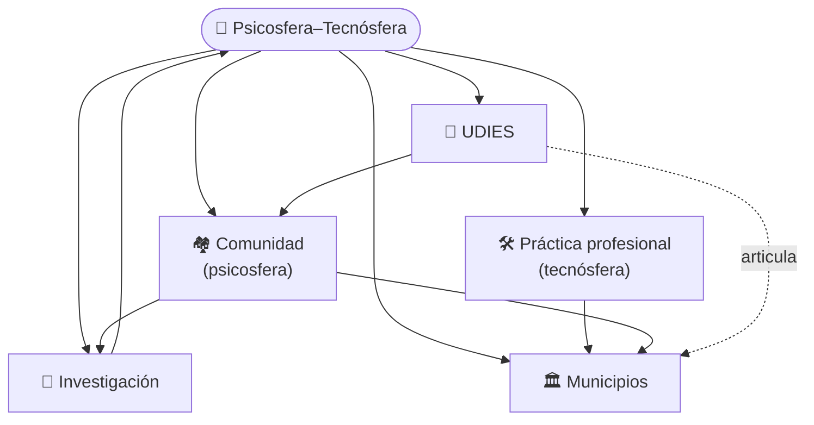

# Gustavo Godoy

**Pienso el territorio como la interacción entre la psicosfera y la tecnósfera.**
Todo lo que hago, como profesional, investigador y desde la comunidad, se ordena bajo esa idea.

*I think of territory as the interaction between psychosphere and technosphere. Everything I do, as a professional, researcher and community partner, is organised under that idea.*

📍 Los Ángeles (Biobío), Chile · Cork, Ireland

---

## 🧠 La idea

Un territorio es más que lo que se ve en un mapa. Lo moldean dos cosas que se influyen todo el tiempo:

- **Tecnósfera: lo que las personas construyen.** Caminos, redes de agua y energía, edificios, máquinas y espacios transformados, como plazas, canales o barrios. Es lo físico, y siempre nace de una decisión humana.
- **Psicosfera: lo que las personas piensan, valoran y deciden.** Cómo se gobierna y quién decide; lo que una comunidad sabe, recuerda y es capaz de hacer en conjunto; los valores y hábitos; y qué tan justo es el reparto de riesgos y beneficios.

Ambas se apoyan en la **naturaleza** del lugar (relieve, agua, clima, sismos), que las condiciona.

Lo importante no es cada una por separado, sino **cómo interactúan**. Por ejemplo, una zona sísmica puede tener vías de evacuación y kits de emergencia (tecnósfera), pero si falta el hábito de prepararse y la confianza en las instituciones (psicosfera), esa tecnología no protege. Y al revés: una comunidad muy organizada con una infraestructura rígida tampoco puede cambiar su situación. De esa interacción depende que una ciudad solo aguante una crisis y quede igual de vulnerable, o logre transformarse.

El problema es que los datos oficiales miden muy bien lo construido y casi no registran lo vivido por las personas. Por eso trabajo con tres aliados: la **comunidad**, que conoce el territorio desde adentro; el **municipio**, que decide; y **UDIES**, un mecanismo que conecta a los tres en proyectos concretos.

Esta idea viene de mi trabajo doctoral sobre 80 ciudades intermedias chilenas.

🔬 El marco completo, el método y los resultados de mi investigación están en el **[sitio de investigación](https://cyberzone8.github.io/psychosphere-technosphere)**.

---

## 🗺️ Cómo se conecta todo

La comunidad aporta la mirada desde el territorio, la profesión aporta el rigor técnico, el municipio decide con ambas, UDIES articula a todos en proyectos concretos y cada proyecto devuelve aprendizaje a la investigación.

---

## 🧭 ¿Quién eres? Elige tu camino

| Si eres… | Qué encontrarás | Ir a |
|---|---|---|
| **Municipio o sector público** | Mi trayectoria y cómo mis capacidades aportan a cada unidad municipal | [📄 CV](https://cyberzone8.github.io/cv) · [🗺️ Mapa de capacidades](https://cyberzone8.github.io/capacidades) |
| **Junta de vecinos u organización comunitaria** | Un trabajo que parte de lo que ustedes saben de su territorio | 🚧 *Próximamente* · [escríbeme](mailto:gustavogodoy.phd@gmail.com?subject=Junta%20de%20vecinos%20%2F%20organizaci%C3%B3n%20comunitaria) |
| **Investigación / academia** | El marco, el método y los resultados | [🔬 Psicosfera–Tecnósfera](https://cyberzone8.github.io/psychosphere-technosphere) |
| **UDIES y organizaciones aliadas** | El mecanismo que articula comunidad, investigación y Estado | 🚧 *Próximamente* · [@udies-org](https://github.com/udies-org) |
| **Educación y capacitación** | Más de 15 años de docencia universitaria | [📄 CV](https://cyberzone8.github.io/cv#experiencia) |
| **Empresa o proyecto técnico** | Lo que puedo aportar en medición, datos y análisis | [🗺️ Mapa de capacidades](https://cyberzone8.github.io/capacidades) |

---

## 🏘️ Comunidad

Las juntas de vecinos y las organizaciones locales saben cosas que ningún registro oficial contiene: qué riesgos se sienten, qué se recuerda del lugar, en quién se confía. Trabajo con ellas mediante **SAATS (Sistema de Articulación y Aprendizaje Territorial)**, una iniciativa que conecta a la comunidad con las instituciones, la investigación y las decisiones en el territorio.

Caso piloto exploratorio: **San Carlos de Purén (Biobío)**. No se publican datos personales ni información sensible de habitantes.

## 🤝 UDIES

**UDIES** (*Unitas Decursui, Investigationali et Studiis Sustentabilitatis*) es un mecanismo de articulación entre la comunidad, la investigación y el Estado. Su propósito es que lo que la comunidad sabe, lo que la investigación aprende y lo que el Estado decide se conecten, para promover la sostenibilidad territorial y un desarrollo comunitario resiliente.

Lo hace de cuatro maneras:

- **Articula** a las juntas de vecinos y organizaciones comunitarias con municipios, gobiernos regionales y servicios públicos.
- **Capacita** a dirigentes comunitarios y a funcionarios públicos.
- **Aplica la investigación** en el territorio, con estudios, laboratorios territoriales y documentación.
- **Formula y gestiona proyectos.** El financiamiento, público o privado, es un medio y no el fin.

Cada proyecto dice qué busca cambiar y cómo se medirá, de modo que produce acción y también aprendizaje. Su forma jurídica, una fundación sin fines de lucro, está en elaboración.

## 🛠️ Práctica profesional

Más de 15 años en docencia universitaria, investigación, gestión de proyectos y asistencia técnica al sector público. Mi CV incluye el [mapa de capacidades](https://cyberzone8.github.io/capacidades), que muestra qué puedo aportar en cada unidad del municipio y con qué evidencia.

Accesos directos: [SECPLA](https://cyberzone8.github.io/capacidades/?u=9) · [DOM](https://cyberzone8.github.io/capacidades/?u=12) · [Protección civil](https://cyberzone8.github.io/capacidades/?u=17) · [DIDECO](https://cyberzone8.github.io/capacidades/?u=19)

**Formación:** Magíster en Evaluación y Gestión de la Información Geográfica (Universidad de Jaén) · Ingeniero de Ejecución en Geomensura (Universidad de Concepción) · Doctorado en Sostenibilidad, estudios completados (UNICEPES).

---

## 📂 Proyectos

| Proyecto | Qué es | Enlace |
|---|---|---|
| Psicosfera–Tecnósfera | La idea y su investigación | [Sitio](https://cyberzone8.github.io/psychosphere-technosphere) · [Repo](https://github.com/cyberzone8/psychosphere-technosphere) |
| CV interactivo | Trayectoria y evidencia | [cyberzone8.github.io/cv](https://cyberzone8.github.io/cv) |
| Mapa de capacidades | Qué aporto en cada unidad municipal | [cyberzone8.github.io/capacidades](https://cyberzone8.github.io/capacidades) |
| SAATS | Trabajo con la comunidad | 🚧 *Próximamente* |
| UDIES | Mecanismo de articulación entre comunidad, investigación y Estado | [@udies-org](https://github.com/udies-org) |

## 📬 Contacto

📧 [gustavogodoy.phd@gmail.com](mailto:gustavogodoy.phd@gmail.com) · 💼 [LinkedIn](https://www.linkedin.com/in/gustavo-godoy-9b505029/)

Escríbeme indicando tu caso: [Municipio](mailto:gustavogodoy.phd@gmail.com?subject=Municipalidad%3A%20consulta) · [Investigación](mailto:gustavogodoy.phd@gmail.com?subject=Colaboraci%C3%B3n%20en%20investigaci%C3%B3n) · [Comunidad](mailto:gustavogodoy.phd@gmail.com?subject=Junta%20de%20vecinos%20%2F%20comunidad) · [UDIES](mailto:gustavogodoy.phd@gmail.com?subject=Fundaci%C3%B3n%20UDIES)

<b>🇬🇧 English summary</b>

I see territories as shaped by the interaction of the **psychosphere** (perception, trust, memory, participation) and the **technosphere** (infrastructure, information, technical systems). Official data capture the technosphere well and miss much of the psychosphere.

So I work with **communities** (who know the territory from within), **municipalities** (who decide) and **UDIES**, a mechanism that links communities, research and the State in concrete projects. My professional practice supplies the technical rigour, and every project feeds learning back into research.

→ [Research](https://cyberzone8.github.io/psychosphere-technosphere) · [CV](https://cyberzone8.github.io/cv) · [Capability map](https://cyberzone8.github.io/capacidades)

