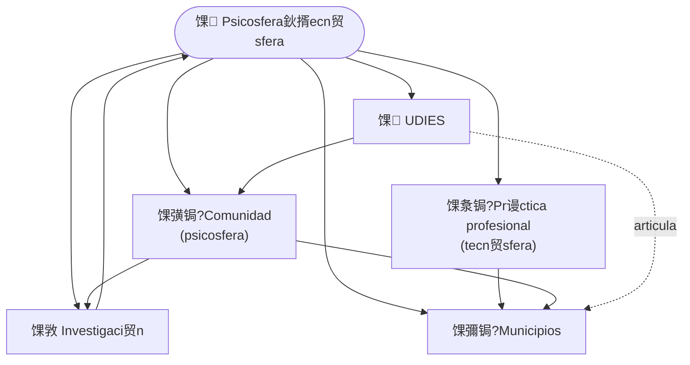

# Gustavo Godoy

**Pienso el territorio como la interacci贸n entre la psicosfera y la tecn贸sfera.**
Todo lo que hago, como profesional, investigador y desde la comunidad, se ordena bajo esa idea.

*I think of territory as the interaction between psychosphere and technosphere. Everything I do, as a professional, researcher and community partner, is organised under that idea.*

馃搷 Los 脕ngeles (Biob铆o), Chile 路 Cork, Ireland

---

## 馃 La idea

Un territorio es m谩s que lo que se ve en un mapa. Lo moldean dos cosas que se influyen todo el tiempo:

- **Tecn贸sfera: lo que las personas construyen.** Caminos, redes de agua y energ铆a, edificios, m谩quinas y espacios transformados, como plazas, canales o barrios. Es lo f铆sico, y siempre nace de una decisi贸n humana.
- **Psicosfera: lo que las personas piensan, valoran y deciden.** C贸mo se gobierna y qui茅n decide; lo que una comunidad sabe, recuerda y es capaz de hacer en conjunto; los valores y h谩bitos; y qu茅 tan justo es el reparto de riesgos y beneficios.

Ambas se apoyan en la **naturaleza** del lugar (relieve, agua, clima, sismos), que las condiciona.

Lo importante no es cada una por separado, sino **c贸mo interact煤an**. Por ejemplo, una zona s铆smica puede tener v铆as de evacuaci贸n y kits de emergencia (tecn贸sfera), pero si falta el h谩bito de prepararse y la confianza en las instituciones (psicosfera), esa tecnolog铆a no protege. Y al rev茅s: una comunidad muy organizada con una infraestructura r铆gida tampoco puede cambiar su situaci贸n. De esa interacci贸n depende que una ciudad solo aguante una crisis y quede igual de vulnerable, o logre transformarse.

El problema es que los datos oficiales miden muy bien lo construido y casi no registran lo vivido por las personas. Por eso trabajo con tres aliados: la **comunidad**, que conoce el territorio desde adentro; el **municipio**, que decide; y **UDIES**, un mecanismo que conecta a los tres en proyectos concretos.

Esta idea viene de mi trabajo doctoral sobre 80 ciudades intermedias chilenas.

馃敩 El marco completo, el m茅todo y los resultados de mi investigaci贸n est谩n en el **[sitio de investigaci贸n](https://cyberzone8.github.io/psychosphere-technosphere)**.

---

## 馃椇锔?C贸mo se conecta todo

La comunidad aporta la mirada desde el territorio, la profesi贸n aporta el rigor t茅cnico, el municipio decide con ambas, UDIES articula a todos en proyectos concretos y cada proyecto devuelve aprendizaje a la investigaci贸n.

---

## 馃Л 驴Qui茅n eres? Elige tu camino

| Si eres鈥?| Qu茅 encontrar谩s | Ir a |
|---|---|---|
| **Municipio o sector p煤blico** | Mi trayectoria y c贸mo mis capacidades aportan a cada unidad municipal | [馃搫 CV](https://cyberzone8.github.io/cv) 路 [馃椇锔?Mapa de capacidades](https://cyberzone8.github.io/capacidades) |
| **Junta de vecinos u organizaci贸n comunitaria** | Un trabajo que parte de lo que ustedes saben de su territorio | 馃毀 *Pr贸ximamente* 路 [escr铆beme](mailto:gustavogodoy.phd@gmail.com?subject=Junta%20de%20vecinos%20%2F%20organizaci%C3%B3n%20comunitaria) |
| **Investigaci贸n / academia** | El marco, el m茅todo y los resultados | [馃敩 Psicosfera鈥揟ecn贸sfera](https://cyberzone8.github.io/psychosphere-technosphere) |
| **UDIES y organizaciones aliadas** | El mecanismo que articula comunidad, investigaci贸n y Estado | 馃毀 *Pr贸ximamente* 路 [@udies-org](https://github.com/udies-org) |
| **Educaci贸n y capacitaci贸n** | M谩s de 15 a帽os de docencia universitaria | [馃搫 CV](https://cyberzone8.github.io/cv#experiencia) |
| **Empresa o proyecto t茅cnico** | Lo que puedo aportar en medici贸n, datos y an谩lisis | [馃椇锔?Mapa de capacidades](https://cyberzone8.github.io/capacidades) |

---

## 馃彉锔?Comunidad

Las juntas de vecinos y las organizaciones locales saben cosas que ning煤n registro oficial contiene: qu茅 riesgos se sienten, qu茅 se recuerda del lugar, en qui茅n se conf铆a. Trabajo con ellas mediante **SAATS (Sistema de Articulaci贸n y Aprendizaje Territorial)**, una iniciativa que conecta a la comunidad con las instituciones, la investigaci贸n y las decisiones en el territorio.

Caso piloto exploratorio: **San Carlos de Pur茅n (Biob铆o)**. No se publican datos personales ni informaci贸n sensible de habitantes.

## 馃 UDIES

**UDIES** (*Unitas Decursui, Investigationali et Studiis Sustentabilitatis*) es un mecanismo de articulaci贸n entre la comunidad, la investigaci贸n y el Estado. Su prop贸sito es que lo que la comunidad sabe, lo que la investigaci贸n aprende y lo que el Estado decide se conecten, para promover la sostenibilidad territorial y un desarrollo comunitario resiliente.

Lo hace de cuatro maneras:

- **Articula** a las juntas de vecinos y organizaciones comunitarias con municipios, gobiernos regionales y servicios p煤blicos.
- **Capacita** a dirigentes comunitarios y a funcionarios p煤blicos.
- **Aplica la investigaci贸n** en el territorio, con estudios, laboratorios territoriales y documentaci贸n.
- **Formula y gestiona proyectos.** El financiamiento, p煤blico o privado, es un medio y no el fin.

Cada proyecto dice qu茅 busca cambiar y c贸mo se medir谩, de modo que produce acci贸n y tambi茅n aprendizaje. Su forma jur铆dica, una fundaci贸n sin fines de lucro, est谩 en elaboraci贸n.

## 馃洜锔?Pr谩ctica profesional

M谩s de 15 a帽os en docencia universitaria, investigaci贸n, gesti贸n de proyectos y asistencia t茅cnica al sector p煤blico. Mi CV incluye el [mapa de capacidades](https://cyberzone8.github.io/capacidades), que muestra qu茅 puedo aportar en cada unidad del municipio y con qu茅 evidencia.

Accesos directos: [SECPLA](https://cyberzone8.github.io/capacidades/?u=9) 路 [DOM](https://cyberzone8.github.io/capacidades/?u=12) 路 [Protecci贸n civil](https://cyberzone8.github.io/capacidades/?u=17) 路 [DIDECO](https://cyberzone8.github.io/capacidades/?u=19)

**Formaci贸n:** Mag铆ster en Evaluaci贸n y Gesti贸n de la Informaci贸n Geogr谩fica (Universidad de Ja茅n) 路 Ingeniero de Ejecuci贸n en Geomensura (Universidad de Concepci贸n) 路 Doctorado en Sostenibilidad, estudios completados (UNICEPES).

---

## 馃搨 Proyectos

| Proyecto | Qu茅 es | Enlace |
|---|---|---|
| Psicosfera鈥揟ecn贸sfera | La idea y su investigaci贸n | [Sitio](https://cyberzone8.github.io/psychosphere-technosphere) 路 [Repo](https://github.com/cyberzone8/psychosphere-technosphere) |
| CV interactivo | Trayectoria y evidencia | [cyberzone8.github.io/cv](https://cyberzone8.github.io/cv) |
| Mapa de capacidades | Qu茅 aporto en cada unidad municipal | [cyberzone8.github.io/capacidades](https://cyberzone8.github.io/capacidades) |
| SAATS | Trabajo con la comunidad | 馃毀 *Pr贸ximamente* |
| UDIES | Mecanismo de articulaci贸n entre comunidad, investigaci贸n y Estado | [@udies-org](https://github.com/udies-org) |

## 馃摤 Contacto

馃摟 [gustavogodoy.phd@gmail.com](mailto:gustavogodoy.phd@gmail.com) 路 馃捈 [LinkedIn](https://www.linkedin.com/in/gustavo-godoy-9b505029/)

Escr铆beme indicando tu caso: [Municipio](mailto:gustavogodoy.phd@gmail.com?subject=Municipalidad%3A%20consulta) 路 [Investigaci贸n](mailto:gustavogodoy.phd@gmail.com?subject=Colaboraci%C3%B3n%20en%20investigaci%C3%B3n) 路 [Comunidad](mailto:gustavogodoy.phd@gmail.com?subject=Junta%20de%20vecinos%20%2F%20comunidad) 路 [UDIES](mailto:gustavogodoy.phd@gmail.com?subject=Fundaci%C3%B3n%20UDIES)

<b>馃嚞馃嚙 English summary</b>

I see territories as shaped by the interaction of the **psychosphere** (perception, trust, memory, participation) and the **technosphere** (infrastructure, information, technical systems). Official data capture the technosphere well and miss much of the psychosphere.

So I work with **communities** (who know the territory from within), **municipalities** (who decide) and **UDIES**, a mechanism that links communities, research and the State in concrete projects. My professional practice supplies the technical rigour, and every project feeds learning back into research.

鈫?[Research](https://cyberzone8.github.io/psychosphere-technosphere) 路 [CV](https://cyberzone8.github.io/cv) 路 [Capability map](https://cyberzone8.github.io/capacidades)

