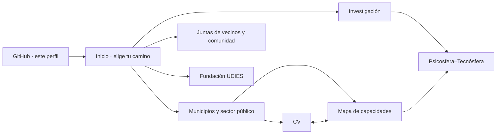

# Gustavo Godoy

**Geomática · Sostenibilidad · Inteligencia territorial · Sistemas complejos**
*Interdisciplinary research · Territorial intelligence · Computational social systems*

📍 Los Ángeles (Biobío), Chile · Cork, Ireland

Trabajo en la intersección entre **información geográfica, sostenibilidad, sistemas complejos e inteligencia artificial**, con más de 15 años de experiencia en docencia universitaria, investigación, gestión de proyectos y asistencia técnica al sector público. Uso las herramientas computacionales como instrumentos para estructurar información y generar hipótesis, no como sustitutos del conocimiento disciplinar.

---

## 🧭 ¿Quién eres? Elige tu camino

| Si eres… | Lo que encontrarás | Ir a |
|---|---|---|
| **Municipio o sector público** (SECPLA, DOM, DIDECO, medio ambiente, emergencias, licitaciones…) | Mi trayectoria, mis capacidades organizadas por unidad del organigrama municipal y la evidencia que las respalda | [📄 CV](https://cyberzone8.github.io/cv) · [🗺️ Mapa de capacidades](https://cyberzone8.github.io/capacidades) |
| **Investigación / academia** | Línea *Psicosfera–Tecnósfera*, método, resultados, preguntas abiertas y cómo citar | [🔬 Psicosfera–Tecnósfera](https://cyberzone8.github.io/psychosphere-technosphere) |
| **Junta de vecinos u organización comunitaria** | Apoyo territorial, mapas y diagnósticos comunitarios, aprendizaje con la comunidad (SAATS) | 🚧 *Próximamente* · por ahora, [escríbeme](mailto:gustavogodoy.phd@gmail.com?subject=Junta%20de%20vecinos%20%2F%20organizaci%C3%B3n%20comunitaria) |
| **Fundación UDIES / organizaciones aliadas** | Inteligencia sistémica y acción estratégica | 🚧 *Próximamente* · [@udies-org](https://github.com/udies-org) |
| **Educación y capacitación** | Docencia universitaria, diseño formativo, talleres de SIG, aprendizaje combinado y ciencia en escuelas | [📄 CV](https://cyberzone8.github.io/cv#experiencia) |
| **Empresa o proyecto técnico** (SIG, drones, topografía, IoT) | Capacidades técnicas y certificaciones | [🗺️ Mapa de capacidades](https://cyberzone8.github.io/capacidades) · [📄 CV](https://cyberzone8.github.io/cv#certificados) |



---

## 🏛️ Para municipios y sector público

- **[CV](https://cyberzone8.github.io/cv)**: formación, experiencia, investigación y certificados, en español e inglés.
- **[Mapa de capacidades](https://cyberzone8.github.io/capacidades)**: matriz de dependencias que muestra cómo se encadenan mis capacidades (de la investigación y la medición en terreno al análisis, el riesgo, la planificación y la gestión) y en qué unidades municipales aportan.

Accesos directos a unidades frecuentes:

| Unidad | Enlace |
|---|---|
| SECPLA | [Ver capacidades](https://cyberzone8.github.io/capacidades/?u=9) |
| Dirección de Obras (DOM) | [Ver capacidades](https://cyberzone8.github.io/capacidades/?u=12) |
| Protección civil y emergencias | [Ver capacidades](https://cyberzone8.github.io/capacidades/?u=17) |
| DIDECO | [Ver capacidades](https://cyberzone8.github.io/capacidades/?u=19) |

**Áreas de aplicación:** cartografía, SIG e IDE · topografía y GNSS · teledetección y drones · calidad de la información geográfica (ISO/TC211) · riesgo de desastres y adaptación climática · planificación territorial · formulación de proyectos y fondos · licitaciones en Mercado Público · capacitación y trabajo con la comunidad.

**Formación destacada:** Magíster en Evaluación y Gestión de la Información Geográfica (Universidad de Jaén) · Ingeniero de Ejecución en Geomensura (Universidad de Concepción) · Doctorado en Sostenibilidad, estudios completados (UNICEPES) · cursos de MIT Professional Education, ChileCompra y Erasmus+ INCHIPE.

---

## 🔬 Investigación

### Psicosfera–Tecnósfera
Línea interdisciplinaria sobre cómo interactúan los procesos humanos, las relaciones sociales, las instituciones y las tecnologías en la evolución de sistemas territoriales complejos.

🌐 **[Sitio de investigación](https://cyberzone8.github.io/psychosphere-technosphere)** · 💻 [Repositorio](https://github.com/cyberzone8/psychosphere-technosphere)

```
Lenguaje natural → Estructuración → Entidades → Capacidades → Relaciones
→ Grafo → Representación semántica → Patrones potenciales → Hipótesis
→ Observación → Validación
```

> **Principio epistemológico:** la similitud computacional puede generar hipótesis; no demuestra por sí misma una relación causal.

### Arquetipos de Resiliencia–Transformabilidad (R–T)
Investigación desarrollada en el contexto de mi trabajo doctoral sobre mecanismos de sostenibilidad en ciudades intermedias chilenas: **80 ciudades**, **4 arquetipos R–T**, período **2005–2023**; casos Copiapó, Talcahuano, Valdivia y Angol.

### SAATS · Sistema de Articulación y Aprendizaje Territorial
Iniciativa comunitaria y territorial para reducir la fragmentación entre las necesidades de la comunidad, las capacidades institucionales, la información, la investigación, la tecnología y las decisiones en el territorio. Caso piloto exploratorio: **San Carlos de Purén (Biobío)**.

### Abierto a colaboración
Psicología social y comunitaria · ciencias sociales computacionales · network science · IA para investigación social · estudios territoriales · salud comunitaria · modelamiento dinámico · sostenibilidad y resiliencia · SIG.

---

## 🛠️ Tecnologías

**Datos y programación:** Python · R · SQL · JavaScript · HTML/CSS · MATLAB/Octave · Git/GitHub · Linux · Docker · APIs REST
**Geoespacial:** ArcGIS · QGIS · ENVI · Erdas Imagine · AutoCAD · drones (UAV) · GNSS
**Análisis y modelamiento:** análisis de redes · análisis semántico · grafos de conocimiento · dinámica de sistemas · análisis estadístico y geoespacial

---

## 📂 Proyectos

| Proyecto | Enfoque | Enlace |
|---|---|---|
| CV interactivo | Trayectoria, certificados y evidencia | [cyberzone8.github.io/cv](https://cyberzone8.github.io/cv) |
| Mapa de capacidades | Capacidades por unidad del organigrama municipal | [cyberzone8.github.io/capacidades](https://cyberzone8.github.io/capacidades) |
| Psicosfera–Tecnósfera | Sistemas sociales computacionales e inteligencia territorial | [Sitio](https://cyberzone8.github.io/psychosphere-technosphere) · [Repo](https://github.com/cyberzone8/psychosphere-technosphere) |
| SAATS | Articulación territorial y aprendizaje comunitario | 🚧 *Próximamente* |
| UDIES | Inteligencia sistémica y acción estratégica | [@udies-org](https://github.com/udies-org) |

---

## 📬 Contacto

📧 [gustavogodoy.phd@gmail.com](mailto:gustavogodoy.phd@gmail.com) · 💼 [LinkedIn](https://www.linkedin.com/in/gustavo-godoy-9b505029/)

Escríbeme indicando tu caso:
[Municipio](mailto:gustavogodoy.phd@gmail.com?subject=Municipalidad%3A%20consulta) · [Investigación](mailto:gustavogodoy.phd@gmail.com?subject=Colaboraci%C3%B3n%20en%20investigaci%C3%B3n) · [Comunidad](mailto:gustavogodoy.phd@gmail.com?subject=Junta%20de%20vecinos%20%2F%20comunidad) · [UDIES](mailto:gustavogodoy.phd@gmail.com?subject=Fundaci%C3%B3n%20UDIES)

> *El humano describe; el sistema estructura; el investigador interpreta; la evidencia valida.*

<details>
<summary><b>🇬🇧 English summary</b></summary>

I work at the intersection of **geomatics, sustainability, complex systems and AI**, with 15+ years in university teaching, research, project management and technical assistance to the public sector.

- **Municipalities / public sector** → [CV](https://cyberzone8.github.io/cv) and [capability map](https://cyberzone8.github.io/capacidades): my capabilities organised by municipal department, with supporting evidence.
- **Research** → [Psychosphere–Technosphere](https://cyberzone8.github.io/psychosphere-technosphere): an interdisciplinary line on territorial intelligence and computational social systems.
- **Community organisations and foundations** → coming soon; get in touch by [email](mailto:gustavogodoy.phd@gmail.com).

*Computational similarity can generate hypotheses; it does not, by itself, demonstrate causality.*

</details>
